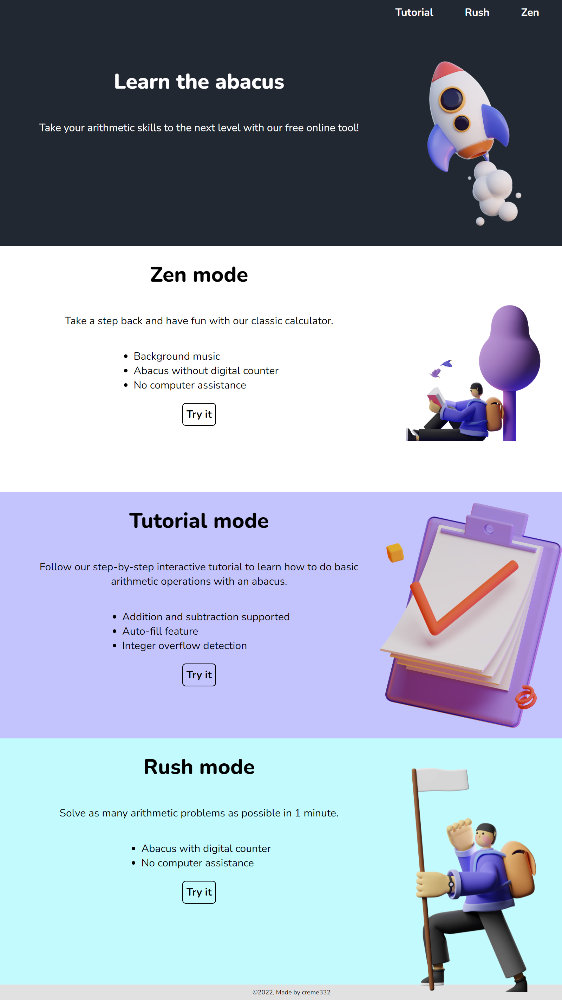
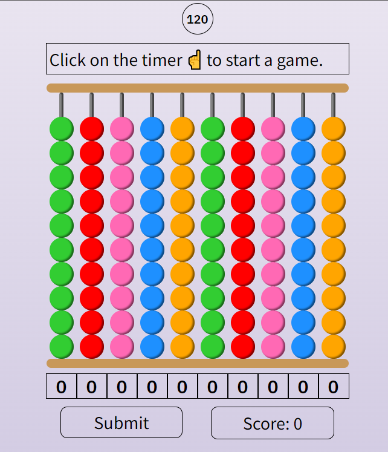
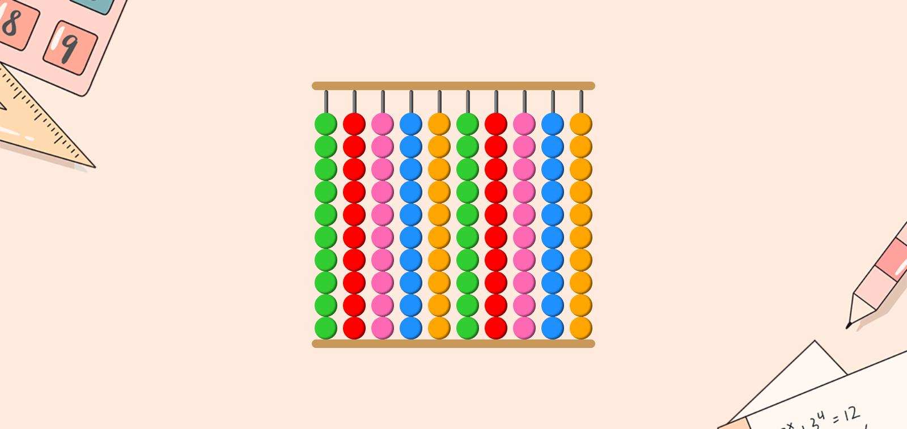

# abacusLite

abacusLite is an interactive abacus learning portal designed to help you master the abacus.

[▶ Live Preview](https://creme332.github.io/abacusLite/)

# 🚀Features
- Mobile-responsive design
- 3 different game modes

# ✨Modes
## Tutorial mode ⛑
Enter two numbers and the computer will walk you through how to use an abacus for basic arithmetic operations. Currently explanations are available only for addition and subtraction.

- Input validation.
- Auto-fill feature.
- Integer overflow detection.
- Step-by-step explanation.

## Rush mode 🏃‍♀️💨
Use the abacus to evaluate math expressions as fast as possible.

## Zen mode 🤪 
Use the classic abacus.

- No computer assistance.
- No animations.
- Sound effects.
- Can be used for addition, subtraction, multiplication, and division.

# 📌 Attributions
Resource | Source
---|---
All images in `assets/img` | pngtree
Background music in zen mode | black coffee by elijah who
Checkbox toggle switch | https://codepen.io/marcusconnor/pen/QJNvMa
3D image on homepage | SALY 3D-Illustration-Pack from Figma

# 🔨 To-Do
- [ ] Add sitemap.
- [ ] Add multiplication and division to tutorial.
- [ ] Improve explanation when oveflow/underflow occurs. 
- [ ] Add option to vary difficulty in Rush mode.
- [ ] Optimize assets
