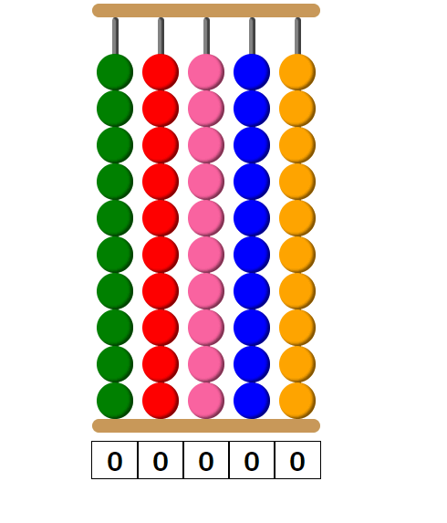

# web-project-template

A concise description of the project.

[▶ Live Preview]()

# 🚀Features

# 📌 Attributions
Resource | Source
---|---
resource| owner

# 🕓 History

# 🔨 To-Do
- [ ] Make website responsive.
- [x] Convert shiftGap into async function
- [ ] Add sitemap.
- [ ] Add project social media preview.

### ✔ Done

# 🐛 Bugs
Bug | How to reproduce | How to fix | Fixed
---|---|---|---|
Create more than 1 gap in a single column by merging beads | While bead A is moving up, quickly click on bead B to cause bead B to move down. Both A and  B will merge. | Must prevent 2 beads in the same column from moving in opposite directions.  Might have to use `transitionend` event listeners.|❌