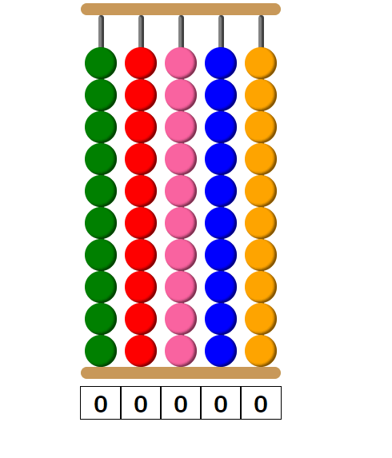
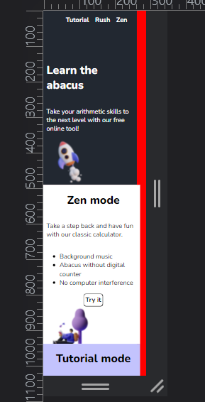

# abacus-tool

An interactive abacus to help you master the abacus.

[▶ Live Preview](https://creme332.github.io/abacus-basics/)

# 🚀Features

## Tutorial mode 
Enter two numbers and the computer will walk you through how to use an abacus for basic arithmetic operations (addition and subtraction).

- Input validation.
- Auto-fill feature.
- Integer overflow detection.
- Step-by-step explanation.

## Rush mode 🏃‍♀️💨
Use the abacus to evaluate given expressions before timer runs out.

## Zen mode 🤪 
Use the classic abacus.

- No computer assistance.
- No animations.
- Background music. (optional)

# 📌 Attributions
Resource | Source
---|---
All images in `assets/img` | pngtree
Background music in zen mode | black coffee by elijah who
Checkbox toggle switch | https://codepen.io/marcusconnor/pen/QJNvMa
3D image on homepage | SALY 3D-Illustration-Pack from Figma

# 🔨 To-Do
- [ ] Add sitemap.
- [ ] Add a diagram showing skeleton and class names.
- [ ] Identify and remove unused css.

### ✔ Done
- [x] Implement rush mode.
- [x] Group css properties
- [x] Add sound effects to zen mode.
- [x] Make website print-friendly.
- [x] Fix merging beads glitch in zen mode.
- [x] Add explanation when overflow occurs.
- [x] Label cells for num1 and num2.
- [x] Allow only 1 digit in each cell. (Use textarea)
- [x] Make website responsive.
- [x] During autofill, prevent user from using abacus.
- [x] use color coding in instruction instead of column 0,1...
- [x] Add project social media preview.
- [x] Convert shiftGap into async function

# 🐛 Bugs
Bug | How to reproduce | How to fix | Fixed
---|---|---|---|
Create more than 1 gap in a single column by merging beads | While bead A is moving up, quickly click on bead B to cause bead B to move down. Both A and  B will merge. | Must prevent 2 beads in the same column from moving in opposite directions.  Might have to use `transitionend` event listeners.|✅
Empty space on right when browser is resized |x|review padding, margin, svg image container size, ... | ❌